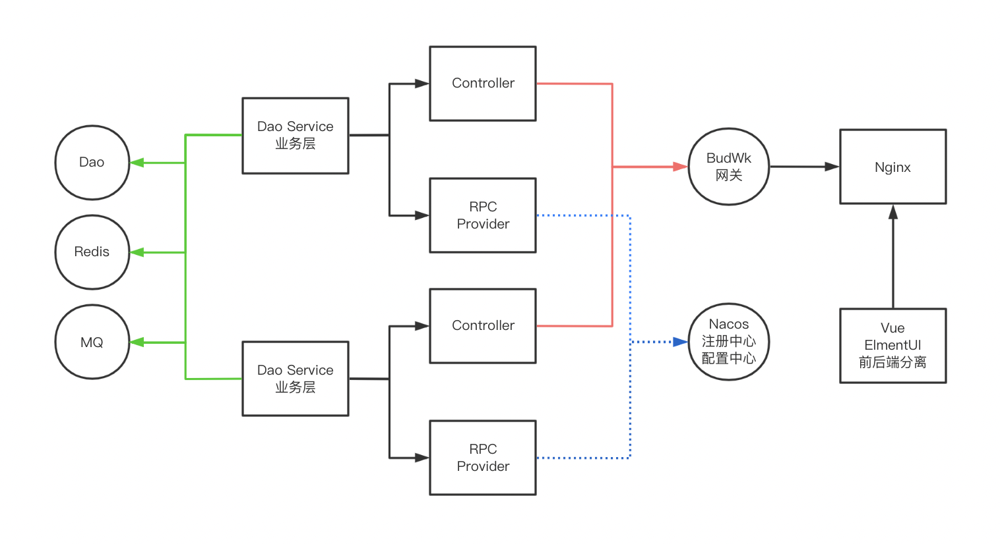

<div align="center">
    <br/>
    <h1>BudWk 开源企业级Java Web开发框架</h1>

[](https://gitee.com/wizzer/NutzWk)
[](https://github.com/budwk/budwk/releases)
[](LICENSE)
[](https://github.com/nutzam/nutz)
</div>

<div align="center">

**[官网](https://budwk.com)** |
**[V7演示地址](https://demo.budwk.com)** |
**[V8开发指南](https://budwk.com)** |
**[V5演示地址](https://nutzwk.wizzer.cn)** |
**[捐赠清单](https://budwk.com/donation)** |

</div>

> 在力所能及的情况下，最大限度的提高Web开发人员的生产力

* QQ1群: 68428921(已满)
* QQ2群: 24457628

# 🚀 简介

BudWk 原名 NutzWk ，是基于国产框架 nutzboot 开发的开源 Java企业级Web开发框架，拥有近十年的开源历史，积累了一大批企业和个人用户，历经V1-V8数次迭代。

V8 在 V7具备的API网关、组件库、认证中心、控制中心等功能基础上，进一步对前后端功能进行升级改造、提升用户体验，同时大大减轻开发工作量，提升开发效率，为产品升级迭代提供极大便利。

框架同时提供`微服务单应用`及`微服务分布式`版本供选择，后台集权限体系、系统参数、数据字典、站内消息、定时任务、CMS、微信等最常用功能，使其具有上手容易、开发便捷、扩展灵活等特性，特别适合各类大中小型定制化项目需求。

# 🎉 本版说明(BudWk v8.x)

## 功能特点

* 使用一套注解实现 OpenAPI3 在线文档的自动生成，同时实现表单参数验证功能，一举多得，减少开发量
* 统一异常拦截处理，业务逻辑判断抛出异常即可被捕获友好输出错误，无需一堆 if else 判断
* 一套控制类日志注解，轻松记录操作人、操作时间、IP、请求参数、响应结果，支持扩展不同数据存储方式
* Excel 文件快速导入导出，只需在 Pojo 类上定义注解即可，支持键值对解析、子类属性解析、自定义日期格式等
* Vue3前端表格支持动态列勾选显示、排序、固定等操作，分页组件进行了封装比Vue2版本减轻 80% 代码量
* 具备丰富的 wk-starter 组件库，使开发微服务应用像搭积木一样简单，组件开发也非常容易

## 运行环境

*   JDK 11 + 或 OpenJDK 11 +
*   Redis 6.x +
*   MariaDB 10.x + 或 MySql 5.7、Oracle、SqlServer、达梦、人大金仓等
*   Nacos 2.0.3 +

## 开发工具
*   IntelliJ IDEA
*   Visual Studio Code
*   Node v19/v18 +
*   Maven 3.6.x +
*   Git

## 简易架构图(分布式版本)



## 目录结构

```lua
budwk                               -- 根目录
│  ├─wk-starter                     -- 组件仓库
│  │  ├─wk-starter-common           -- 通用类组件
│  │  ├─wk-starter-database         -- 数据库组件
│  │  ├─wk-starter-apiauth          -- API接口权限组件
│  │  ├─wk-starter-config           -- 配置组件(支持Nacos配置中心)
│  │  ├─wk-starter-dependencies     -- 所有依赖
│  │  ├─wk-starter-dubbo            -- Dubbo组件
│  │  ├─wk-starter-email            -- Email组件
│  │  ├─wk-starter-excel            -- Excel导入导出组件
│  │  ├─wk-starter-gateway          -- 网关组件
│  │  ├─wk-starter-job              -- 简易定时任务组件
│  │  ├─wk-starter-log              -- 日志及SLog组件
│  │  ├─wk-starter-openapi          -- 接口文档生成组件
│  │  ├─wk-starter-security         -- 权限验证组件
│  │  ├─wk-starter-sms              -- 短信发送组件
│  │  ├─wk-starter-storage          -- 文件存储组件
│  │  ├─wk-starter-web              -- WEB拦截跨越表单验证组件
│  ├─wk-gateway                     -- 网关中心
│  │  ├─websocket                   -- WebScoket支持
│  ├─wk-platform                    -- 控制中心
│  │  ├─wk-platform-common          -- 通用类供其他模块调用
│  │  ├─wk-platform-server          -- 服务类提供API及RPC服务
│  ├─wk-ucenter                     -- 认证中心
│  ├─wk-cms                         -- CMS管理
│  │  ├─wk-cms-common               -- 通用类供其他模块调用
│  │  ├─wk-cms-server               -- 服务类提供API及RPC服务
│  ├─wk-wechat                      -- 微信管理
│  │  ├─wk-wechat-common            -- 通用类供其他模块调用
│  │  ├─wk-wechat-server            -- 服务类提供API及RPC服务
│  ├─wk-mini                        -- 可独立运行单应用版本
│  ├─wk-vue3-admin                  -- Vue3前端代码 TS + Vite + Elment-Plus
```
* 代码生成器IDEA插件,请下载安装 [https://gitee.com/budwk/budwk-codegenerator](https://gitee.com/budwk/budwk-codegenerator)
* 推荐组件中心、控制中心、前端等功能模块独立创建Git仓库,便于权限管理及升级迭代

## V8技术选型
### 后端技术
技术 | 名称 | 官网
----|------|----
Nutz | JavaEE应用框架  | [https://nutzam.com](https://nutzam.com)
NutzBoot | 微服务框架  | [https://github.com/nutzam/nutzboot](https://github.com/nutzam/nutzboot)
SaToken | 权限框架  | [http://sa-token.dev33.cn](http://sa-token.dev33.cn)
Druid | 数据库连接池  | [https://github.com/alibaba/druid](https://github.com/alibaba/druid)
Nacos | 配置及注册中心  | [https://nacos.io](https://nacos.io)
Dubbo | 分布式服务框架  | [https://dubbo.apache.org](https://dubbo.apache.org)
Redis | 分布式缓存数据库  | [https://redis.io](https://redis.io)
Quartz | 作业调度框架  | [https://www.quartz-scheduler.org](https://www.quartz-scheduler.org)
IdGenerator | 雪花主键生成  | [https://github.com/yitter/IdGenerator](https://github.com/yitter/IdGenerator)
Hutool | 工具集合  | [https://hutool.cn](https://hutool.cn)

### Vue3前端技术
技术 | 名称 | 官网
----|------|----
Vue3 | MVVM框架 | [https://vuejs.org](https://vuejs.org)
Vite | 应用框架 | [https://vitejs.dev](https://vitejs.dev)
Element-Plus | 基于Vue3的UI框架 | [https://element-plus.gitee.io/zh-CN](https://element-plus.gitee.io/zh-CN/)
Font-awesome | 字体图标  | [https://fontawesome.com](https://fontawesome.com)

## 简易开发指南

### Java后端
*   确保 MySql、Redis、Nacos 默认端口配置并已启动
*   MySql 创建名为 `budwk_v8` 的空数据库,在每个微服务模块启动时会自动建表,同时初始化数据
*   在单个NB模块下执行 `mvn compile nutzboot:run` 运行或 `mvn package nutzboot:shade` 生成可执行jar包
*   在后端项目根目录执行 `mvn -Dmaven.javadoc.skip=true -Dmaven.test.skip=true -Dnutzboot.dst=E:/dst clean package nutzboot:shade` 可将所有可运行jar包生成到指定位置
*   分别启动jar文件 `nohup java -jar budwk.jar >/dev/null 2>&1 &`
*   正常启动前端后访问 `http://127.0.0.1:8800` 用户名 superadmin 密码 1
*   API调试 `http://127.0.0.1:9900/platform/openapi` `http://127.0.0.1:9900/ucenter/openapi` 等 
*   wk-mini 单应用版本API调试路径为 `http://127.0.0.1:9900/openapi`

### Vue3前端(wk-vue3-admin)

* `npm install pnpm`
* `pnpm install`
* `pnpm run dev`

## 详细开发指南

[https://budwk.com](https://budwk.com)

## 服务器部署

### jar 运行

*   指定配置文件运行 `nohup java -jar -Dnutz.profiles.active=pro -Xmx450m wk-platform-server.jar >/dev/null 2>&1 &`

### docker 部署示例

`wk-gateway`

* 编译可执行jar `mvn clean package nutzboot:shade`

* 编译docker image `docker build -t wizzer/budwk-wk-gateway:v8 .`

`wk-platform`

* 编译可执行jar `mvn clean package nutzboot:shade`

* 编译docker image `docker build -t wizzer/budwk-wk-platform:v8 .`

`wk-ucenter`

* 编译可执行jar `mvn clean package nutzboot:shade`

* 编译docker image `docker build -t wizzer/budwk-wk-ucenter:v8 .`

其他NB模块省略...然后挂载 `/conf` 路径,把配置文件 `application.yaml` 放好

# 🤝 鸣谢

*   [@wendal](https://github.com/wendal) 代码贡献者,Nutz/LuatOS主要作者
*   [@rekoe](https://github.com/Rekoe) 代码贡献者
*   [@enilu](https://github.com/enilu) IDEA插件代码贡献者
*   [@threefish](https://github.com/threefish) IDEA插件代码贡献者
*   [@loyalove](https://github.com/loyalove) 前端代码贡献者
*   [@syrxw](https://github.com/syrxw) 前端代码贡献者

<br/>

> 如果您觉得还不错请在右上角点一下 star，帮忙转发，谢谢 🙏🙏🙏 大家的支持是开源最大动力
