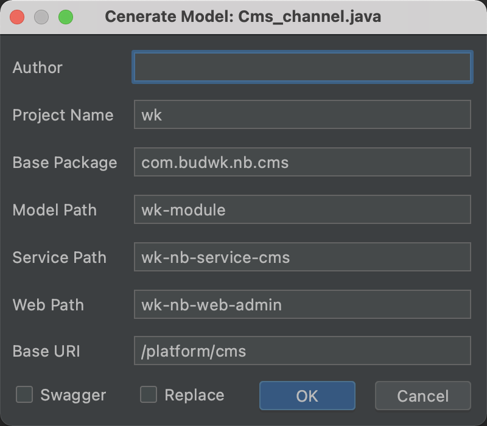

# budwk-codegenerator
BudWk 代码生成器IDEA插件

[https://gitee.com/budwk/budwk-codegenerator](https://gitee.com/budwk/budwk-codegenerator)

[https://github.com/budwk/budwk-codegenerator](https://github.com/budwk/budwk-codegenerator)

### 使用说明

* 插件不依赖任何第三方jar包
* 通过 POJO 类生成接口类、接口实现类、控制类
* 需通过 IDEA 打开项目根目录加载项目
* 打开 POJO 类Java文件，在文件内部右击选择"Generate"->"WkCodeGenerator"

